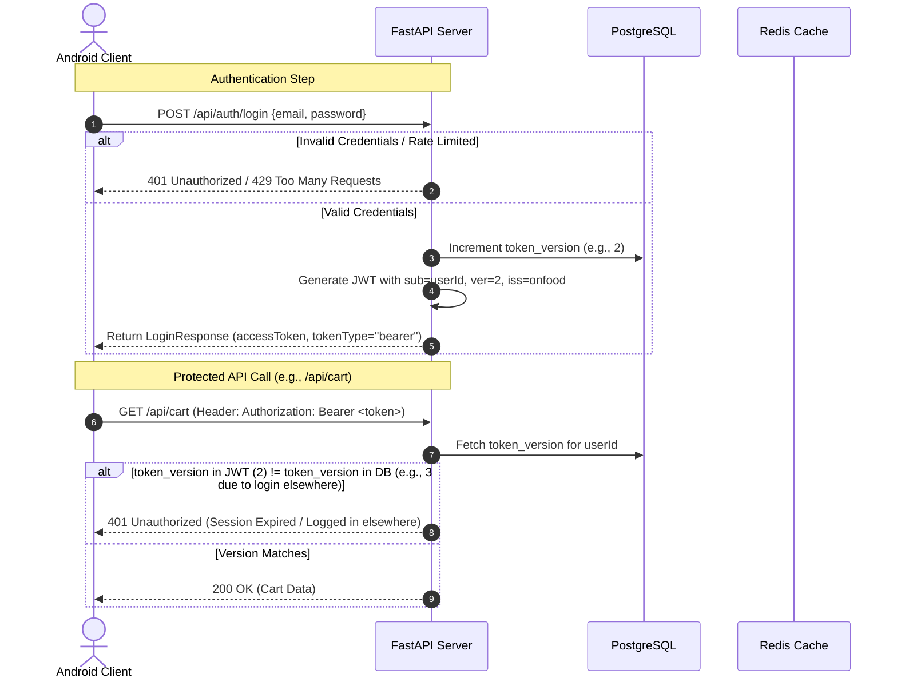
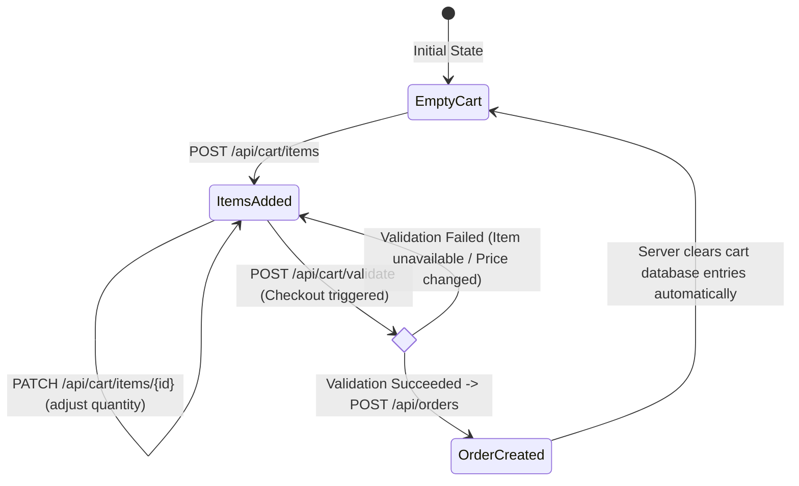
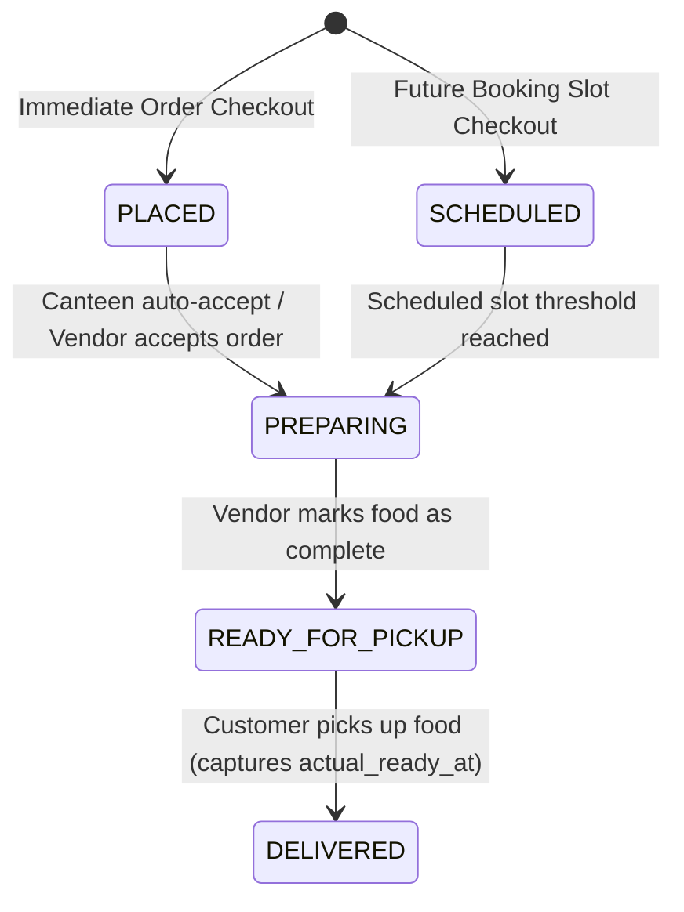

# OnFood API Architecture & Workflow Guide

This document outlines the complete end-to-end API workflows of the OnFood server, detailing data processing, security boundaries, and interaction paradigms between the Android client, the backend service, and database states.

---

## 1. Authentication & Security Framework

The API utilizes a stateless token authentication model with active backend session-revocation checks for high-sensitivity endpoints.



### 🔐 Newly Implemented Security Hardening
* **Brute-Force Protection**: Login and OTP verification endpoints are protected by a sliding-window rate limiter (10 attempts / 15 minutes) mapped per client IP. In multi-worker environments, these counts are tracked atomically in Redis.
* **Centralized Token Decoders**: Avoids inline JWT parsing. All tokens undergo strict HS256 signature checking, expiration verification, and issuer mismatch validation.
* **Strict Schema Validation**: Request models explicitly forbid unrecognized/extraneous parameters (`extra="forbid"`) to prevent query pollution and mass-assignment vulnerabilities.
* **Sanitized Logs**: Log rotation prevents directory pollution. Request payloads, response payloads (under production), and SSE query-parameters (`?token=`) are systematically redacted to shield sensitive data from log files.

---

## 2. Onboarding & Registration Workflow

Before ordering, customers choose their campus location parameters. A WhatsApp OTP system gates active account status.

```mermaid
graph TD
    A[Start App Onboarding] --> B[Get Campus/Colleges list]
    B -->|GET /api/locations/colleges| C[Select College]
    C -->|GET /api/locations/colleges/{id}/canteens| D[Select Preferred Canteen]
    D --> E[Submit Registration]
    E -->|POST /api/auth/register| F[WhatsApp OTP sent to student]
    F -->|POST /api/auth/verify-otp| G[Account Activated & JWT issued]
    
    C -->|Not listed?| H[Suggest College]
    H -->|POST /api/locations/colleges/suggest| C
```

1. **Location Resolution**:
   * Client lists campuses and colleges dynamically using unauthenticated endpoints.
   * If a college is missing, the user submits a suggestion via `/api/locations/colleges/suggest`. The college is immediately usable in a pending approval state.
2. **Account Creation**:
   * Registration creates a user with `phone_verified = False` and hashes passwords with `bcrypt`.
   * An OTP record containing a hashed code is created in the database and dispatched via the WhatsApp API gateway.
3. **Activation**:
   * The user supplies the 6-digit code to `/api/auth/verify-otp`.
   * After checking maximum attempts ($\le 5$) and expiration, the server updates `phone_verified = True`, drops the OTP record, increments `token_version`, and returns the initial session token.

---

## 3. Menu Sync & Cache Layer

To ensure fast rendering, menu data is synced locally to the device cache and checked against dynamic kitchen settings.

```
[Android Client] ──(GET /api/menu/sync?since=lastSync)──► [FastAPI Server]
                                                            │
                                        ┌───────────────────┴───────────────────┐
                                        ▼ (Redis URL check)                     ▼
                               [Redis Cache Layer]                     [PostgreSQL DB]
                                  (Reads categories & items)             (Fallback / Write)
```

* **Incremental Sync**: The endpoint `/api/menu/sync` takes a `since` timestamp parameter. The client only downloads categories and dishes changed since that date, minimizing data consumption.
* **Cache TTL**: Menu listings are served directly from Redis when available, invalidating every 120 seconds.
* **Kitchen Interlocking**: Public endpoints `/api/kitchen/status` disclose if the canteen is currently accepting orders and its general load.

---

## 4. Persistent Cart & Checkout Workflow

OnFood stores cart entries server-side to guarantee consistency across multi-device scenarios. Carts are locked to single canteens.



### Dynamic ETA Calculations
When an immediate order is checked out, the server calculates prep time as:
$$\text{ETA} = \max(\text{Ordered Item Prep Times}) + (\text{Active Orders} \times \text{Kitchen Buffer})$$

This prevents the kitchen from underestimating wait times during high-volume periods.

---

## 5. Order Management & Real-Time Streams

Active order progression is piped through server-sent channels so users receive status updates with sub-second latencies.



### Real-Time Update Stream (SSE & WebSockets)
To keep status tracking synchronous without polling, the app leverages persistent sockets:

1. **Connection**:
   * Customers connect to Server-Sent Events `/api/orders/stream/{userId}?token=<JWT>` or WebSocket `/ws/orders/{userId}?token=<JWT>`.
   * The server validates the token and confirms the token owner matches the path `userId`.
2. **PostgreSQL Event Bridge**:
   * When a status changes (e.g., `PREPARING` $\rightarrow$ `READY_FOR_PICKUP` on a vendor dashboard), the server performs a DB update.
   * A DB trigger fires a `NOTIFY` event, which the FastAPI startup listener picks up via an asynchronous connection pool.
   * The server instantly broadcasts the updated payload to the matching user's SSE queue and WebSocket socket.

---

## 6. API Reference Sheet

| Domain | Method | Endpoint | Auth | Purpose |
|---|---|---|---|---|
| **Health** | `GET` | `/` | 🔓 Public | Server health verification |
| **Auth** | `POST` | `/api/auth/register` | 🔓 Public | Registers a student account |
| | `POST` | `/api/auth/login` | 🔓 Public | Exchange credentials for JWT |
| | `PATCH` | `/api/auth/profile` | 🔒 Token (Verified) | Updates user profile details |
| **Menu** | `GET` | `/api/menu/sync` | 🔓 Public | Synchronize cached menu data |
| | `GET` | `/api/menu/categories` | 🔓 Public | Retrieve category metadata |
| **Cart** | `GET` | `/api/cart` | 🔒 Token (Verified) | Fetch persistent cart items |
| | `POST` | `/api/cart/items` | 🔒 Token (Verified) | Add dish to cart |
| | `POST` | `/api/cart/validate` | 🔒 Token (Verified) | Pre-checkout validation |
| **Orders** | `POST` | `/api/orders` | 🔒 Token (Verified) | Place order (immediate/scheduled) |
| | `GET` | `/api/orders/history` | 🔒 Token (Verified) | Fetch user's order history |
| | `GET` | `/api/orders/stream/{userId}` | 🔒 Token | SSE status tracking stream |
| | `GET` | `/ws/orders/{userId}` | 🔒 Token | WebSocket status tracking stream |
| | `PATCH` | `/api/orders/{id}/status` | 🔒 Token (Owner Only)| Update order status |

---

## 7. Error Handling Contracts

Error states follow a unified Spring-Boot style JSON model mapping consistent status codes:

```json
{
  "timestamp": "2026-07-21T18:55:00",
  "status": 400,
  "error": "Bad Request",
  "message": "Validation failed: Field 'quantity': Input should be less than or equal to 99"
}
```

### Standard Error Mapping
* **`400 Bad Request`**: Validation errors, expired OTPs, scheduling constraints, or quantity violations.
* **`401 Unauthorized`**: Token missing, invalid signature, or token version mismatch (session revoked).
* **`403 Forbidden`**: Ownership mismatch (e.g., trying to access or change status of another user's order).
* **`404 Not Found`**: Resource missing (invalid MenuItem UUID, missing Order ID).
* **`429 Too Many Requests`**: IP rate limit exceeded.
* **`500 Internal Server Error`**: Generic server faults (raw error strings suppressed under production mode).
