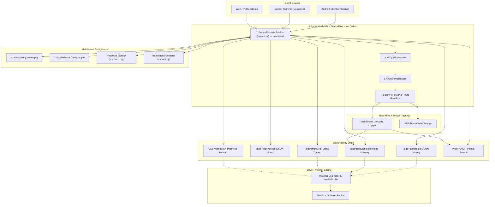
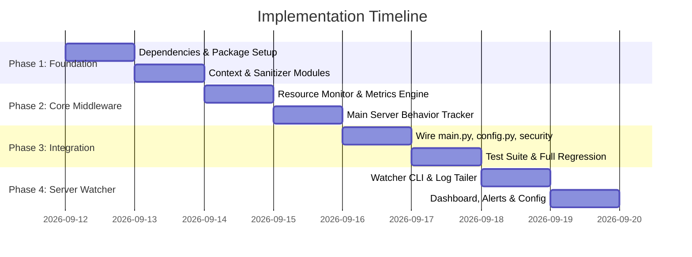

# 📋 Project Plan: OnFood Server Behavior Tracking & Watcher System

> **Project Name**: OnFood Server Behavior Tracking Middleware & Server Watcher  
> **Target Repositories**: 
> - `c:\Users\karth\OneDrive\Desktop\onfood\onfoodserver` (FastAPI Core Backend)
> - `c:\Users\karth\OneDrive\Desktop\onfood\server_watcher` (Watcher & Observability Hub)  
> **Date**: September 2026  
> **Status**: Planning & Ready for Execution  

---

## 1. Executive Summary

This project establishes comprehensive, production-grade observability and behavior tracking for the **OnFood Backend Ecosystem**. It delivers deep runtime insights into request latencies, system resource utilization (CPU, Memory/RSS), active concurrency, error traces, and client behaviors while ensuring strict data privacy and zero disruption to real-time streams (SSE & WebSockets).

### Core Goals
1. **Low-Overhead Middleware Engine**: Replace the legacy inline `dev_request_logger` in `app/main.py` with a decoupled `app/middleware/` package.
2. **Resource & Concurrency Accounting**: Monitor process CPU%, RAM (RSS), and in-flight request counts across async lifecycle stages using `psutil`.
3. **Enterprise Privacy & Security**: Recursively redact passwords, tokens, API keys, and OTPs across JSON bodies, query parameters, and headers — raw `Authorization`, `Cookie`, and `X-App-Key` header values must **never** reach any log file.
4. **Context Propagation**: Provide `ContextVars` so that request IDs, client IPs, and authenticated user contexts seamlessly attach to all logs and database operations.
5. **Observability Standards**: Expose standard Prometheus exposition format (`/metrics`) for Grafana/Prometheus scraping alongside JSON Lines rotating file logs (`logs/request.log`, `logs/response.log`, `logs/behavior.log`, `logs/errors.log`).
6. **WebSocket & SSE Awareness**: HTTP middleware covers all REST endpoints. WebSocket connections (`/ws/orders/{userId}`) are tracked via a dedicated lifecycle logger. SSE streaming responses are detected and passed through without body buffering.
7. **Server Watcher Utility**: Equip `server_watcher` with real-time log ingestion, terminal dashboard monitoring, and anomaly detection.

---

## 2. System Architecture

> [!NOTE]
> **Middleware execution order in FastAPI**: Middleware added **last** runs **first** (onion model). The `@app.middleware("http")` behavior tracker is registered after GZip and CORS, so it executes **outermost** — wrapping everything. The numbers below reflect actual execution order, not registration order.



---

## 3. Project Breakdown & File Manifest

### A. Core Middleware Package (`onfoodserver/app/middleware/`)

| File Path | Responsibility |
|:---|:---|
| `app/middleware/__init__.py` | Package initialization, clean export boundary, and `onfood.exceptions` logger re-registration (ensures `errors.log` file handler survives the `main.py` refactor). |
| `app/middleware/context.py` | `ContextVar` definitions (`request_id_var`, `client_ip_var`, `user_var`), custom `LogRecordFactory`, and request ID generators. |
| `app/middleware/sanitizer.py` | Recursive dictionary/list redactor (`SENSITIVE_KEYS`), query parameter sanitizer, header value sanitizer, and body truncation helpers. |
| `app/middleware/resources.py` | Thread-safe in-flight request counter and lazy `psutil` process sampler (`ResourceSnapshot`, `ResourceMonitor`). Controlled by `ENABLE_RESOURCE_TRACKING` — returns zeroes when disabled. |
| `app/middleware/metrics.py` | Prometheus collectors (`http_requests_total`, `http_request_duration_seconds`, gauges) and `/metrics` route mounter. Entire module is a no-op when `ENABLE_METRICS=False`. |
| `app/middleware/tracker.py` | Primary ASGI HTTP middleware orchestrating timing, body extraction, security headers, metrics emission, and rotating JSON logs. Reads `SLOW_REQUEST_THRESHOLD_MS` from config (never hardcoded). |

### B. Core Backend Integration (`onfoodserver/`)

| File Path | Modifications Needed |
|:---|:---|
| `requirements.txt` | Add `psutil>=5.9.0` and `prometheus-client>=0.20.0`. |
| `app/config.py` | Add `SLOW_REQUEST_THRESHOLD_MS`, `ENABLE_METRICS`, and `ENABLE_RESOURCE_TRACKING` with conditional wiring. |
| `app/main.py` | Remove legacy inline `dev_request_logger` (lines 142–311) and inline logging setup (lines 24–81). Initialize `install_context_logging()`, register `_behavior_tracker` middleware, mount `/metrics`, update `lifespan()` startup log to use middleware loggers, and add WebSocket lifecycle logging. |
| `app/security.py` | Add `/metrics` to the `require_app_client` bypass list (alongside `/`) so Prometheus scrapers work in production without `X-App-Key`. |
| `tests/test_server_behavior_middleware.py` | Integration and unit test suite using existing `async_client` fixture pattern from `conftest.py` (not sync `TestClient`). |

### C. Watcher Engine (`server_watcher/`)

| File Path | Responsibility |
|:---|:---|
| `watcher.py` | Main CLI entry point. Contains `LogTailer` (async file tail of `behavior.log`, `errors.log`), `HealthProbe` (periodic `GET /` polling), `MetricsScraper` (periodic `GET /metrics` parsing). |
| `dashboard.py` | Terminal UI renderer using `rich.live` and `rich.table`. Displays live panels: request rate, p95/p99 latency, active memory RSS, in-flight count, recent errors, and endpoint heatmap. |
| `alerts.py` | Rule-based alert engine. Fires console warnings and optional webhook notifications when thresholds are breached (latency > threshold, 5xx spike, memory > limit). |
| `config.json` | Watcher configuration. See schema below. |
| `requirements.txt` | `rich>=13.0.0`, `httpx>=0.27.0`, `psutil>=5.9.0`. |

#### `config.json` Example Schema
```json
{
  "server_url": "http://localhost:8000",
  "log_directory": "../onfoodserver/logs",
  "poll_interval_seconds": 5,
  "tail_files": ["behavior.log", "errors.log"],
  "alerts": {
    "latency_warn_ms": 500,
    "latency_critical_ms": 2000,
    "error_rate_threshold_per_minute": 10,
    "memory_warn_mb": 256,
    "memory_critical_mb": 512
  }
}
```

---

## 4. Log Schema Documentation

> [!IMPORTANT]
> The new middleware changes the JSON schema for `request.log` and `response.log` (adds fields) and introduces an entirely new `behavior.log`. Any downstream parsers or the `server_watcher` must use these schemas.

### `request.log` — Before vs After

| Field | Before (old) | After (new) | Notes |
|:---|:---:|:---:|:---|
| `req_id` | ✅ | ✅ | |
| `client_ip` | ✅ | ✅ | |
| `event` | ✅ | ✅ | |
| `method` | ✅ | ✅ | |
| `path` | ✅ | ✅ | Raw URL path |
| `path_template` | ❌ | ✅ | **NEW** — Route template (e.g. `/api/orders/{orderId}`) |
| `query` | ✅ | ✅ | |
| `request_json` | ✅ | ✅ | Suppressed in production |
| `user` | ❌ | ✅ | **NEW** — `{user_id, role, canteen_id}` from JWT |
| `user_agent` | ❌ | ✅ | **NEW** — Client User-Agent string |
| `content_length` | ❌ | ✅ | **NEW** — Request body size in bytes |

### `response.log` — Before vs After

| Field | Before (old) | After (new) | Notes |
|:---|:---:|:---:|:---|
| `req_id` | ✅ | ✅ | |
| `client_ip` | ✅ | ✅ | |
| `event` | ✅ | ✅ | |
| `method` | ✅ | ✅ | |
| `path` | ✅ | ✅ | |
| `path_template` | ❌ | ✅ | **NEW** |
| `status` | ✅ | ✅ | |
| `duration_ms` | ✅ | ✅ | |
| `response_json` | ✅ | ✅ | Suppressed in production |
| `request_bytes` | ❌ | ✅ | **NEW** — Request payload size |
| `response_bytes` | ❌ | ✅ | **NEW** — Response payload size |

### `behavior.log` — New File (Full Schema)

```json
{
  "req_id": "a1b2c3d4",
  "event": "request_behavior",
  "method": "GET",
  "path_template": "/api/menu/categories",
  "status": 200,
  "duration_ms": 32.4,
  "in_flight_at_start": 3,
  "in_flight_at_end": 2,
  "memory_rss_mb": 84.2,
  "cpu_percent": 1.4,
  "request_bytes": 0,
  "response_bytes": 1234,
  "is_slow": false,
  "is_error": false,
  "client_ip": "192.168.1.10",
  "user_id": "uuid-here"
}
```

### WebSocket Lifecycle Events (in `behavior.log`)

```json
{
  "event": "ws_connect",
  "path": "/ws/orders/{userId}",
  "user_id": "uuid-here",
  "client_ip": "192.168.1.10",
  "timestamp": "2026-09-12T12:00:00Z"
}
```
```json
{
  "event": "ws_disconnect",
  "path": "/ws/orders/{userId}",
  "user_id": "uuid-here",
  "duration_seconds": 342.5,
  "reason": "client_closed"
}
```

---

## 5. Phase-by-Phase Implementation Roadmap



### Phase 1: Foundation & Safe Data Handling
- [ ] Add `psutil` and `prometheus-client` to `onfoodserver/requirements.txt` and install into virtual environment.
- [ ] Create package directory `onfoodserver/app/middleware/` and `__init__.py`.
- [ ] In `__init__.py`, re-register the `onfood.exceptions` logger with a `RotatingFileHandler` pointed at `logs/errors.log` (this handler is currently set up in `main.py` lines 52–59 and must survive the refactor).
- [ ] Implement `app/middleware/context.py` with `ContextVar` management and custom logging factory.
- [ ] Implement `app/middleware/sanitizer.py` with comprehensive redaction for:
  - JSON body keys: `password`, `otp`, `token`, `access_token`, `refresh_token`, `authorization`, `hashed_password`, `secret`, `api_key`, `app_key`.
  - Query parameters: `token`, `access_token`.
  - Explicit guarantee: raw `Authorization`, `Cookie`, and `X-App-Key` header values are **never** logged. Only decoded, non-sensitive JWT claims (`sub`, `role`) are written.

### Phase 2: Resource Monitoring & Prometheus Metrics
- [ ] Implement `app/middleware/resources.py` with lock-based in-flight request counting and resilient `psutil` sampling.
  - When `ENABLE_RESOURCE_TRACKING=False`, `snapshot()` returns `ResourceSnapshot(0.0, 0.0, in_flight)` without importing `psutil`.
- [ ] Implement `app/middleware/metrics.py` configuring Prometheus Counter, Histogram, and Gauge metrics.
  - When `ENABLE_METRICS=False`, all `record_*` / `set_*` methods are no-ops and `mount_metrics_endpoint()` does nothing.
- [ ] Implement `/metrics` endpoint with authentication bypass (see Phase 3 security change).

### Phase 3: Main Behavior Tracker & Server Wiring
- [ ] Implement `app/middleware/tracker.py` encapsulating the entire request/response lifecycle:
  - Header inspection & correlation ID assignment.
  - Streaming detection: check `Content-Type` for `text/event-stream` and `multipart/` — bypass body iterator consumption for these responses.
  - High-precision latency calculation using `time.perf_counter()`.
  - Read `app_config.SLOW_REQUEST_THRESHOLD_MS` for slow request detection (do **not** hardcode `500`).
  - Security header injection (`X-Content-Type-Options`, `Referrer-Policy`, conditional `HSTS`).
  - Structured multi-target logging (`request.log`, `response.log`, `behavior.log`, `errors.log`).
  - JWT user extraction is best-effort with `verify_signature=False` — logged `user_id` may reflect invalid/expired tokens.
- [ ] Update `onfoodserver/app/config.py` with observability settings:
  ```python
  SLOW_REQUEST_THRESHOLD_MS: int = 500
  ENABLE_METRICS: bool = True
  ENABLE_RESOURCE_TRACKING: bool = True
  ```
- [ ] Update `onfoodserver/app/security.py` — add `/metrics` to the `require_app_client` bypass list:
  ```python
  # In require_app_client():
  if request.url.path in ("/", "/metrics"):
      return
  ```
  This ensures Prometheus scrapers can reach `/metrics` in production without `X-App-Key`.
- [ ] Refactor `onfoodserver/app/main.py`:
  - Strip lines 24–81 (old logging definitions, `_safe_log_data`, `_json_body`, `_SENSITIVE_KEYS`, etc.).
  - Strip lines 142–311 (old `_SKIP_LOG_PREFIXES`, `_C`, `_status_color`, `_method_color`, `dev_request_logger`).
  - Wire `install_context_logging()` after imports.
  - Register `@app.middleware("http")` calling `server_behavior_tracker`.
  - Invoke `mount_metrics_endpoint(app)`.
  - **Update `lifespan()` startup log** (lines 90–91): import loggers from middleware package instead of deleted module-level `request_logger`/`response_logger`:
    ```python
    from app.middleware.tracker import request_logger, response_logger
    request_logger.info(json.dumps(startup_data))
    response_logger.info(json.dumps(startup_data))
    ```
  - **Add WebSocket lifecycle logging** to `/ws/orders/{userId}` endpoint:
    ```python
    behavior_logger.info(json.dumps({"event": "ws_connect", ...}))
    # ... on disconnect:
    behavior_logger.info(json.dumps({"event": "ws_disconnect", ...}))
    ```

> [!WARNING]
> **Scope limitation**: `@app.middleware("http")` does **not** fire for WebSocket connections. WebSocket tracking is added directly in the endpoint handler via explicit log calls, not through the middleware. This is a FastAPI/Starlette limitation.

### Phase 4: Test Suite & Full Regression Defense
- [ ] Write `onfoodserver/tests/test_server_behavior_middleware.py`:
  - Use existing `async_client` fixture from `conftest.py` (with `httpx.AsyncClient` + `ASGITransport` + `CLIENT_HEADERS`) — **not** sync `TestClient`.
  - Verify `X-Request-Id` and `X-Response-Time-Ms` response headers.
  - Test client-supplied `X-Request-Id` propagation (echo back).
  - Test sensitive payload & query param redaction (passwords, tokens, OTPs).
  - Test concurrency tracking: `ResourceMonitor` increment/decrement/floor-at-zero.
  - Test `ResourceSnapshot` returns valid data.
  - Test Prometheus `/metrics` route availability and payload structure.
  - **Test SSE/streaming passthrough**: hit an SSE endpoint and verify response is not corrupted by body iterator consumption.
- [ ] Run **full** existing test suite to verify no regressions:
  ```powershell
  pytest tests/ -v   # ALL tests, not just the new file
  ```

### Phase 5: Server Watcher Client (`server_watcher/`)
- [ ] Initialize `server_watcher/` directory structure with `requirements.txt`, `config.json`, and Python modules.
- [ ] Implement `watcher.py` — main CLI entry point:
  - `LogTailer` class: async file tail (seek-to-end + poll) of `behavior.log` and `errors.log`. Discovers log directory from `config.json` `log_directory` field (relative or absolute path, CLI override via `--logs` argument).
  - `HealthProbe` class: periodic `GET /` to `server_url`, logs up/down transitions, tracks response time trend.
  - `MetricsScraper` class: periodic `GET /metrics`, parses Prometheus text format, extracts key gauge/counter values for dashboard.
- [ ] Implement `dashboard.py` — terminal UI using `rich.live`:
  - **Panel 1 — Request Rate**: Rolling 1m/5m request count from `behavior.log` entries.
  - **Panel 2 — Latency**: p50, p95, p99 from parsed `duration_ms` values.
  - **Panel 3 — Resources**: Current memory RSS (MB) and CPU % from latest `behavior.log` entry or `/metrics` scrape.
  - **Panel 4 — In-Flight**: Current concurrent request count gauge.
  - **Panel 5 — Recent Errors**: Last 10 entries from `errors.log` with timestamp, path, and error type.
  - **Panel 6 — Endpoint Heatmap**: Top 10 endpoints by request volume, color-coded by avg latency.
- [ ] Implement `alerts.py` — rule-based alert engine:
  - Reads thresholds from `config.json` `alerts` section.
  - Fires `rich.console` warnings with severity icons (🟡 warn, 🔴 critical).
  - Alert triggers: latency > threshold, 5xx rate spike, memory > limit, health probe failure.
  - Optional: webhook URL for external notification (Slack, Discord).
- [ ] Create `config.json` with documented schema (see Section 3C above).
- [ ] Create `requirements.txt`: `rich>=13.0.0`, `httpx>=0.27.0`, `psutil>=5.9.0`.

---

## 6. Risk Assessment & Mitigations

| Risk / Challenge | Impact | Mitigation Strategy |
|:---|:---|:---|
| **Streaming Response Breakage** | 🔴 Critical | SSE (`text/event-stream`) and multipart responses must not be consumed into memory. Middleware checks `Content-Type` and bypasses body iterator pooling. **Verified by a dedicated test case.** |
| **`onfood.exceptions` Logger Orphaned** | 🔴 Critical | The existing `exceptions.py` general handler logs to `onfood.exceptions`. The middleware package `__init__.py` re-registers this logger's file handler so it survives the `main.py` refactor. |
| **`/metrics` Blocked by App-Client Guard** | 🔴 Critical | `require_app_client` rejects requests without `X-App-Key` in production. `/metrics` is added to the bypass list alongside `/` so Prometheus scrapers work. |
| **`lifespan()` References Deleted Loggers** | 🔴 Critical | `lifespan()` startup log uses `request_logger` / `response_logger`. After refactor, these are imported from `app.middleware.tracker` instead of being module-level in `main.py`. |
| **WebSocket Invisible to HTTP Middleware** | 🟡 Important | `@app.middleware("http")` does not fire for WebSocket upgrades. WebSocket lifecycle events (connect/disconnect/duration) are logged directly in the endpoint handler via `behavior_logger`. |
| **Metric Cardinality Explosion** | 🟡 Important | Raw URL paths (e.g. `/api/orders/38291`) in Prometheus labels cause unbounded memory. Middleware normalizes to route templates (`/api/orders/{orderId}`) via `request.scope.get("route")`. |
| **High CPU Overhead from `psutil`** | 🟡 Important | `cpu_percent(interval=None)` compares system ticks since last call instantaneously without blocking. Disabled entirely when `ENABLE_RESOURCE_TRACKING=False`. |
| **Hardcoded Thresholds** | 🟡 Important | `SLOW_REQUEST_THRESHOLD_MS` is read from `app_config` — never hardcoded. `ENABLE_METRICS` and `ENABLE_RESOURCE_TRACKING` are honored as conditional guards. |
| **Log Volume & Disk Bloat** | 🟠 Moderate | Rotating file handlers: `maxBytes=10MB`, `backupCount=5`. Production mode suppresses full JSON request/response bodies, keeping only routing metadata. |
| **Credential Leakage in Logs** | 🟠 Moderate | Strict sanitization recursively scrubs JSON bodies and query params. Raw `Authorization`, `Cookie`, `X-App-Key` headers are **never** logged. Only decoded JWT claims (`sub`, `role`) are written. |
| **Unverified JWT in Behavior Logs** | 🟠 Moderate | `tracker.py` decodes JWT without signature verification for logging. Logged `user_id` may reflect forged/expired tokens. **Do not use `user_id` from logs for security decisions.** |
| **Test Style Inconsistency** | 🔵 Minor | New tests use existing `async_client` fixture from `conftest.py` (async `httpx`) — not sync `TestClient` — ensuring consistency with the 6 existing test files. |

---

## 7. Verification & Acceptance Criteria

### Automated Verification
```powershell
cd c:\Users\karth\OneDrive\Desktop\onfood\onfoodserver
.\.venv\Scripts\Activate.ps1

# Run ALL tests (new middleware tests + full existing suite for regression)
pytest tests/ -v
```
- **Pass Criteria**: All test cases pass. Zero regressions in existing `test_server.py`, `test_canteen_security.py`, `test_forgot_password.py`, etc.

### Runtime Verification
1. **Server Start**:
   ```powershell
   uvicorn app.main:app --host 0.0.0.0 --port 8000 --reload
   ```
   Confirm: zero import errors, `install_context_logging()` active, startup event logged to `logs/request.log`.

2. **Behavior Logging**:
   Execute requests against `/api/menu/categories` and check `logs/behavior.log`:
   ```json
   {
     "req_id": "9f2a1b4c",
     "event": "request_behavior",
     "method": "GET",
     "path_template": "/api/menu/categories",
     "status": 200,
     "duration_ms": 32.4,
     "in_flight_at_start": 1,
     "in_flight_at_end": 0,
     "memory_rss_mb": 84.2,
     "cpu_percent": 1.4,
     "is_slow": false
   }
   ```

3. **Metrics Exposition**:
   ```powershell
   curl http://localhost:8000/metrics
   ```
   Verify `http_requests_total`, `http_request_duration_seconds_bucket`, and `process_memory_rss_bytes` are present. Must work **without** `X-App-Key` header even when `APP_CLIENT_KEY` is set.

4. **Sensitive Data Verification**:
   ```powershell
   # Send a login request with password
   curl -X POST http://localhost:8000/api/auth/login -H "Content-Type: application/json" -d '{"email":"test@test.com","password":"secret123"}'
   
   # Verify password is redacted in logs
   Select-String "secret123" logs\request.log   # Must return ZERO matches
   Select-String "REDACTED" logs\request.log     # Must return matches
   ```

5. **Error Logging Survival**:
   Trigger a 500 error and verify it appears in `logs/errors.log` with request ID, method, path, and stack trace.

6. **WebSocket Lifecycle Logging**:
   Connect a WebSocket client to `/ws/orders/{userId}` and verify `ws_connect` / `ws_disconnect` events appear in `logs/behavior.log`.

7. **Server Watcher Execution**:
   ```powershell
   cd c:\Users\karth\OneDrive\Desktop\onfood\server_watcher
   python watcher.py
   ```
   Verify live terminal dashboard shows request rate, latency percentiles, memory usage, and error alerts.
